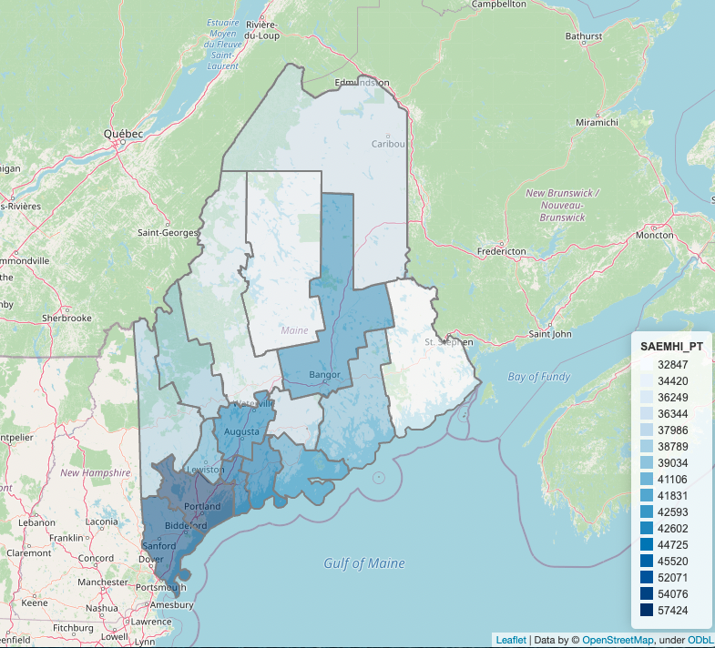
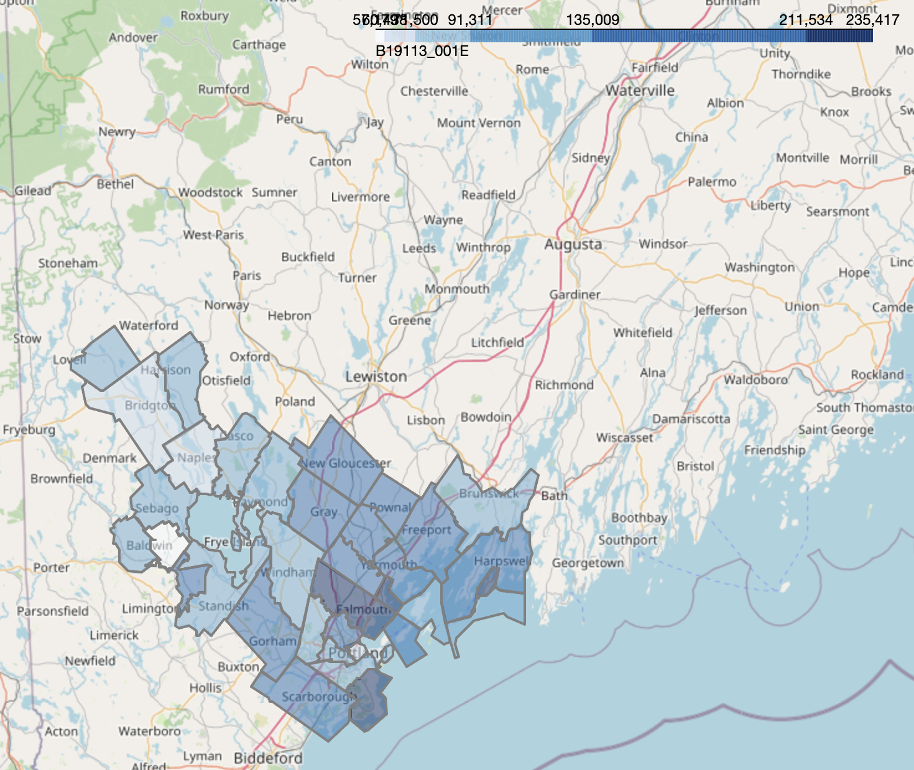
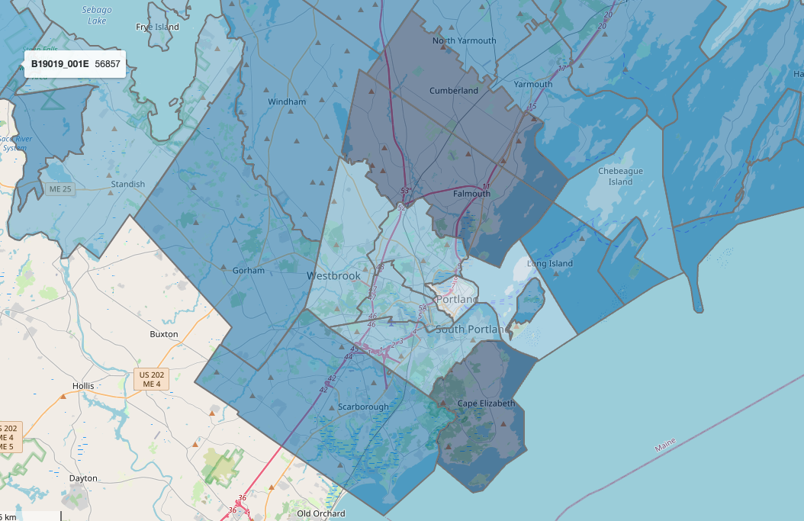
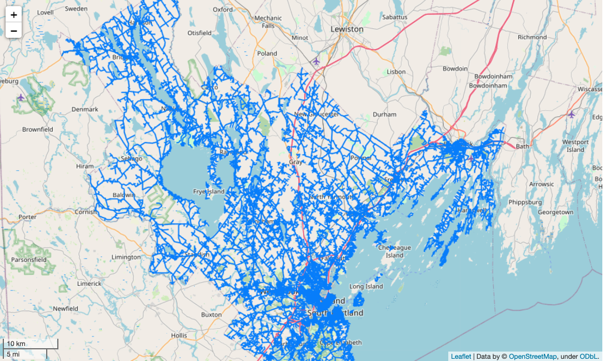
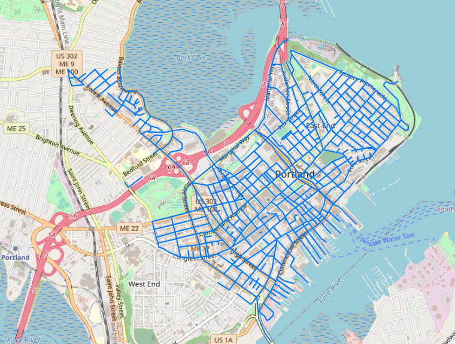
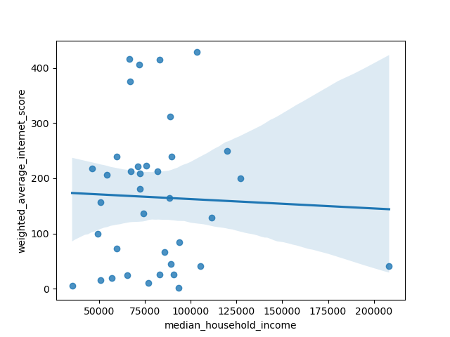
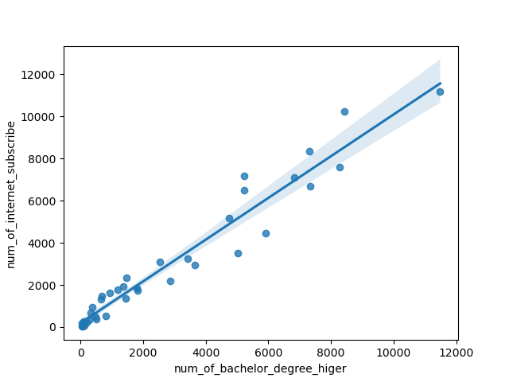
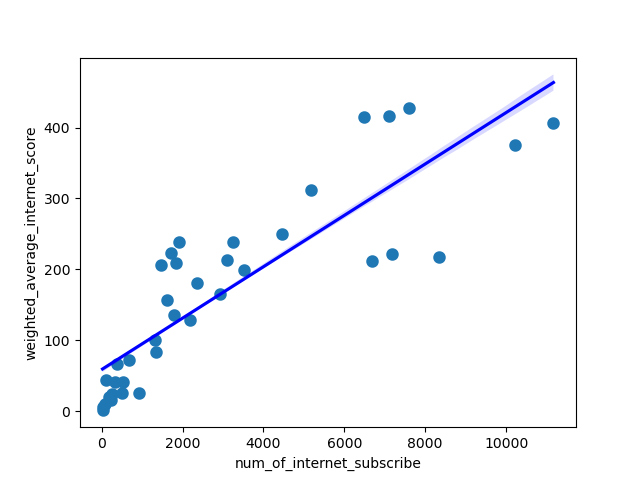

# Project (template)

# Broadband and Socio-economic demographics

Developed by DS5110 students at [The Roux Institute](https://roux.northeastern.edu/), Northeastern University, Summer 2022.

Data and guidance provided by [Maine Connectivity Authority](https://www.maineconnectivity.org/) and comes as a continuation of our fellow [DS 5010 spring 2022 class project](https://ds5010.github.io/broadband/).

We used [The US Census Bureau APIs](https://www.census.gov/data/developers/data-sets.html) for the socio-economic datasets.

## Overview

This repository provides a fictional example of a project proposal for DS5110, Summer 2022.
It's based on the [broadband project](https://github.com/ds5010/broadband) completed by Portland students in
the Spring 2022 version of DS 5010.
Their project was eventually put in a publicly accessible repository and included a
github-pages (gh-pages) site: [ds5010.github.io/broadband/](https://ds5010.github.io/broadband/).
You can use this repo as guidance for creating your own project proposal.
Additional guidance is in the [course repo](https://github.com/ds5110/summer-2022/blob/main/projects/projects.md).

## Project partners

- [Zheng Yin(Yune)](https://github.com/zyune)
- [Evrard Ngabirano](https://github.com/ebibia)

## Goal

The project goal is to develop an interpretation model for Tiers data of Maine at the county level based on poverty rate and possibly other socioeconomic factors.
We'll start by digging deep in to the census data.
Then we will investigating the relationship between
tiers data with socio-economic data.
The broadband access and socio-economic demographics varies across Maine, creating the need for county-level and state-level data visuals to provide support for the decision making body and MCA's projects.

## Data

Primary sources of data will be CDC and Johns Hopkins university.

- [Small Area Income and Poverty Estimates (1989, 1993, 1995-2016)](https://www.census.gov/programs-surveys/saipe/about.html)
- [state,School District level.](https://api.census.gov/data/timeseries/poverty/saipe/schdist/examples.html)
- [Population Estimates and Projections ](https://www.census.gov/data/developers/data-sets/popest-popproj.html)
- [Economic Census (2017, 2012, 2007, 2002)](https://www.census.gov/data/developers/data-sets/economic-census.2017.html)
- [Maine Office of GIS](https://maine.hub.arcgis.com/datasets/ec1a999644cf4e128c84d207f6b8e2bc)
- [Maine Connectivity Authority](https://www.maineconnectivity.org/)

## Stakeholder

[Maine Connectivity Authority](https://www.maineconnectivity.org/)

## Preliminary result

You can see the family median income of Maine in county level. Deeper the blue is , Higher the family median income of county.
It was created using a APi to get data from the Census site. Then I combine the data from census with Maine county border geojson data. You can download the [html page](https://github.com/zyune/broadband-final-ds5110/raw/family_median_income_demo/demo/family_median_income/family_median_income.html) here.


You can see the family median income of Maine in cumberland county.
You can download the [html page](https://github.com/ds5110/project-zyune/blob/main/demo/family_median_income_zipcode_level/family_median_income_Cumberland_percentile.html) here


## Final result

### 1 Combine data

RUN `python splity_zipcode_eco_social_by_maine_county.py`
I did several things in this python file.

- 1.read geo dataframe of Maine zipcodes
- 2.compose sensus.gov url and return the dataframe containing data from sensus.gov
- 3. combine the dataframes from step1 ans step2
- 4. split the dataframe from step 4 according to the Maine county boundary
- 5. save them into county file according to county name.

[example of sensus API, it shows population of 04101](https://api.census.gov/data/2020/acs/acs5?get=NAME,B01001_001E&for=zip%20code%20tabulation%20area:04101)

[Maine zip code geography data](https://github.com/ds5110/project-zyune/blob/main/data/Zip_code_Maine_geojson/maine_zip_code.geojson)

#### explore some gemography data of Maine go for this colab playground

[colab playground](https://colab.research.google.com/drive/1kxISjdbGsx9dU6RNxjdqAaYsma1HZUQr)

```
STATEFP10	ZCTA5CE10	GEOID10	CLASSFP10	MTFCC10	FUNCSTAT10	ALAND10	AWATER10	INTPTLAT10	INTPTLON10	PARTFLG10	zip code tabulation area	NAME	B01001_001E	geometry
0	23	4003	2304003	B5	G6350	S	2984238	51865836	+43.7272611	-069.9568988	N	4003	ZCTA5 04003	214	POLYGON ((-69.99717 43.73110, -69.99823 43.731...
1	23	4009	2304009	B5	G6350	S	146675592	25387866	+44.0462407	-070.7284236	N	4009	ZCTA5 04009	5335	POLYGON ((-70.68929 44.11102, -70.68928 44.110...
2	23	4011	2304011	B5	G6350	S	121022203	19695964	+43.8964309	-069.9733865	N	4011	ZCTA5 04011	20565	POLYGON ((-69.99317 43.93131, -69.99229 43.930...
3	23	4015	2304015	B5	G6350	S	82235850	6181761	+43.9762866	-070.5211090	N	4015	ZCTA5 04015	3838	POLYGON ((-70.56889 43.91041, -70.57029 43.910...
4	23	4017	2304017	B5	G6350	S	9210888	41609162	+43.7389545	-070.0883958	N	4017	ZCTA5 04017	515	POLYGON ((-70.12301 43.70166, -70.12669 43.703...
```



### 2 filter Tiers data into zipcode

RUN `python tiers_to_zipcdoe_divistion.py`

This python file filter tier0 to tier5 in cumberland to zipcode level.

#### If you want to explore the tiers data in zipcode level of cumberland county, go for following

[Tier_4 zipcode level playground](https://colab.research.google.com/drive/1corVtfYj05I1rcOtEuzQVHkZqCurNzHO#scrollTo=KZSTk184h45K)





### 3 prepare data for analysis

RUN `python retrieve_data_for_analysis.py`

This .py file try to calculate the number of tiers in zipcode area of cumberland county
and combine it with the social economy data.

#### Explore this csv file

[data combine tiers and gemography data](https://github.com/ds5110/project-zyune/blob/main/Zipcode/number_of_tiers_cumberlamd_zipcode.csv)

```
ZCTA5CE10	total_population	num_of_bachelor_degree_higer	num_of_internet_subscribe	median_household_income	num_tier_0	num_tier_1	num_tier_2	num_tier_3	num_tier_4	num_tier_5
0	4003	214	80	113	89097	2	5	0	0	168	0
1	4009	5335	1356	1920	59505	4	72	16	0	900	0
2	4011	20565	6827	7116	66699	30	14	9	0	1579	0
3	4015	3838	941	1625	50625	9	22	0	0	595	0
4	4017	515	200	230	50833	0	0	108	46	13	0
```

### 4 calculate weighted average internet speed score

`RUN python calculate_average_internet_speed_score.py`

#### Explore this csv file

[calculate weighted average of internet speed score](https://github.com/ds5110/project-zyune/blob/main/Zipcode/weighted_average_internet_score.csv)

```
ZCTA5CE10	total_population	num_of_bachelor_degree_higer	num_of_internet_subscribe	median_household_income	num_tier_0	num_tier_1	num_tier_2	num_tier_3	num_tier_4	num_tier_5	weighted_average_internet_score	education_rate	subscribe_rate
0	4003	214	80	113	89097	2	5	0	0	168	0	44.298246	0.373832	0.528037
1	4009	5335	1356	1920	59505	4	72	16	0	900	0	239.087719	0.254171	0.359888
2	4011	20565	6827	7116	66699	30	14	9	0	1579	0	416.324561	0.331972	0.346025
3	4015	3838	941	1625	50625	9	22	0	0	595	0	156.964912	0.245180	0.423398
4	4017	515	200	230	50833	0	0	108	46	13	0	16.105263	0.388350	0.446602
```

## 5 plot relationship between several features

`python scatterplot_sav_fig.py`

### median house hold income versus internet score



### rate of bachelor degree or higher versus rate of internet subscribe



### number of internet subscribe versus number of internet subscribe


