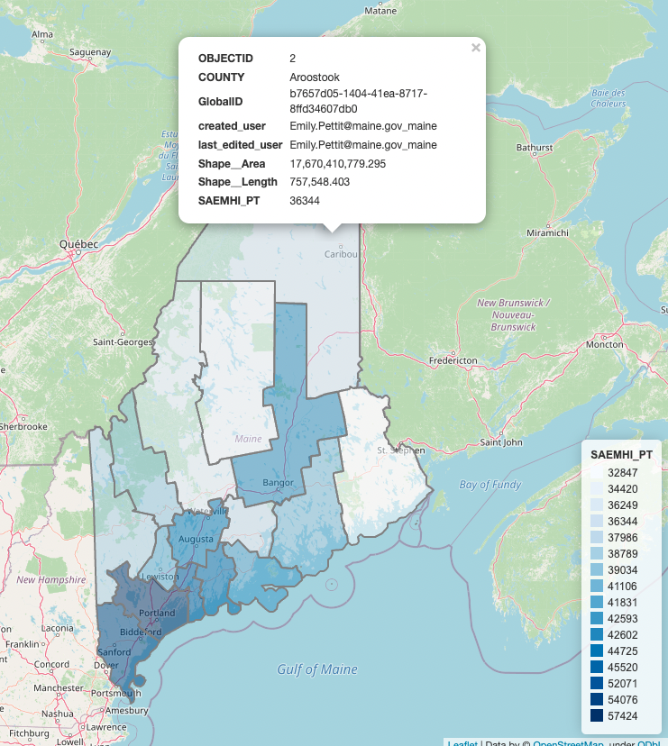

# Project (template)

# Broadband and Socio-economic demographics

Developed by DS5110 students at The Roux Institute, Northeastern University, Summer 2022.

Data and guidance provided by Maine Connectivity Authority and comes as a continuation of our fellow DS 5010 spring 2022 class project.

We used The US Census Bureau APIs for the socio-economic datasets.

## NOTE to students

This repository provides a fictional example of a project proposal for DS5110, Summer 2022.
It's based on the [vaccines project](http://ds5010/vaccines) completed by Portland students in
the Spring 2022 version of DS 5010.
Their project was eventually put in a publicly accessible repository and included a
github-pages (gh-pages) site: [ds5010.github.io/vaccines](ds5010.github.io/vaccines).
You can use this repo as guidance for creating your own project proposal.
Additional guidance is in the [course repo](https://github.com/ds5110/summer-2022/blob/main/projects/projects.md).

## Project partners

- [Zheng Yin(Yune)](https://github.com/zyune)
- Evrard Ngabirano

## Goal

The project goal is to develop an interpretation model for Tiers data of Maine at the county level based on poverty rate and possibly other socioeconomic factors.
We'll start by digging deep in to the census data.
Then we will investigating the relationship between
tiers data with socio-economic data.
The broadband access and socio-economic demographics varies across Maine, creating the need for county-level and state-level data visuals to provide support for the decision making body and MCA's projects.

## Data

Primary sources of data will be CDC and Johns Hopkins university.

- [Small Area Income and Poverty Estimates (1989, 1993, 1995-2016)](https://www.census.gov/programs-surveys/saipe/about.html)
- [state,School District level.](https://api.census.gov/data/timeseries/poverty/saipe/schdist/examples.html)
- [Population Estimates and Projections ](https://www.census.gov/data/developers/data-sets/popest-popproj.html)
- [Economic Census (2017, 2012, 2007, 2002)](https://www.census.gov/data/developers/data-sets/economic-census.2017.html)
- [Maine Office of GIS](https://maine.hub.arcgis.com/datasets/ec1a999644cf4e128c84d207f6b8e2bc)
- [Maine Connectivity Authority](https://www.maineconnectivity.org/)

## Stakeholder

This could be a faculty member or someone from an organization with an interest in this problem who
would be willing to provide feedback on your prototypes.

## Preliminary result

You can see the family median income of Maine in county level. Deeper the blue is , Higher the family median income of county.
It was created using a APi to get data from the Census site. Then I combine the data from census with Maine county border geojson data. You can download the [html page](https://github.com/zyune/broadband-final-ds5110/raw/family_median_income_demo/demo/family_median_income/family_median_income.html) here.

## Project plan

[plan.md](plan.md)
