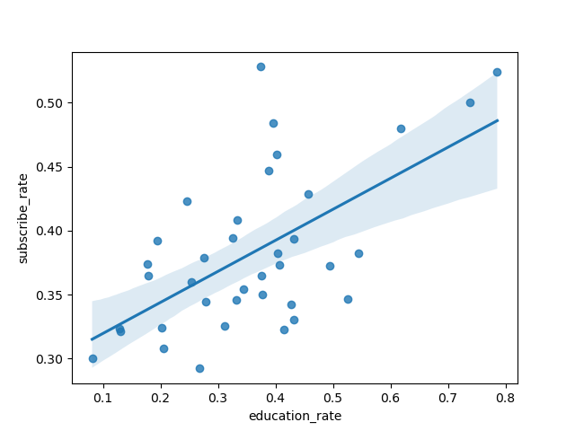
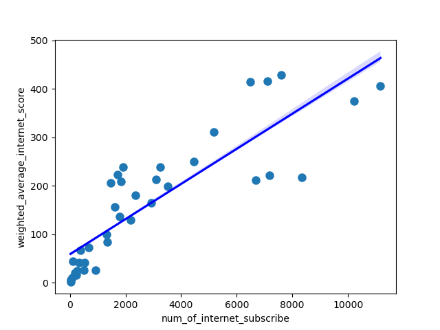

##1
RUN `python splity_zipcode_eco_social_by_maine_county.py`
This read data from census.gov api and combine data with zipcode geography of Maine.
##2

RUN `python tiers_to_zipcdoe_divistion.py`

It filter tier0 to tier5 in cumberland to zipcode level geography.

##3
RUN `python retrieve_data_for_analysis.py`

This .py file try to calculate the number of tiers in zipcode area of cumberland county
and combine it with the social economy data.

```
ZCTA5CE10	total_population	num_of_bachelor_degree_higer	num_of_internet_subscribe	median_household_income	num_tier_0	num_tier_1	num_tier_2	num_tier_3	num_tier_4	num_tier_5
0	4003	214	80	113	89097	2	5	0	0	168	0
1	4009	5335	1356	1920	59505	4	72	16	0	900	0
2	4011	20565	6827	7116	66699	30	14	9	0	1579	0
3	4015	3838	941	1625	50625	9	22	0	0	595	0
4	4017	515	200	230	50833	0	0	108	46	13	0
```

##4 calculate weighted average internet speed score
`RUN python calculate_average_internet_speed_score.py`

```
	ZCTA5CE10	total_population	num_of_bachelor_degree_higer	num_of_internet_subscribe	median_household_income	num_tier_0	num_tier_1	num_tier_2	num_tier_3	num_tier_4	num_tier_5	weighted_average_internet_score
0	4003	214	80	113	89097	2	5	0	0	168	0	44.298246
1	4009	5335	1356	1920	59505	4	72	16	0	900	0	239.087719
2	4011	20565	6827	7116	66699	30	14	9	0	1579	0	416.324561
3	4015	3838	941	1625	50625	9	22	0	0	595	0	156.964912
4	4017	515	200	230	50833	0	0	108	46	13	0	16.105263
```

## 5 plot relationship between several features

`python src/scatterplot_sav_fig.py`

### median house hold income versus internet score


### number of bachelor degree or higher versus number of internet subscribe



### number of internet subscribe versus number of internet subscribe


